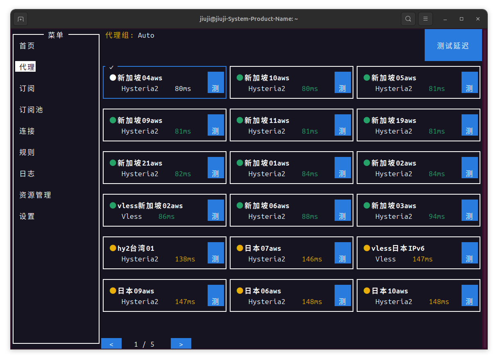
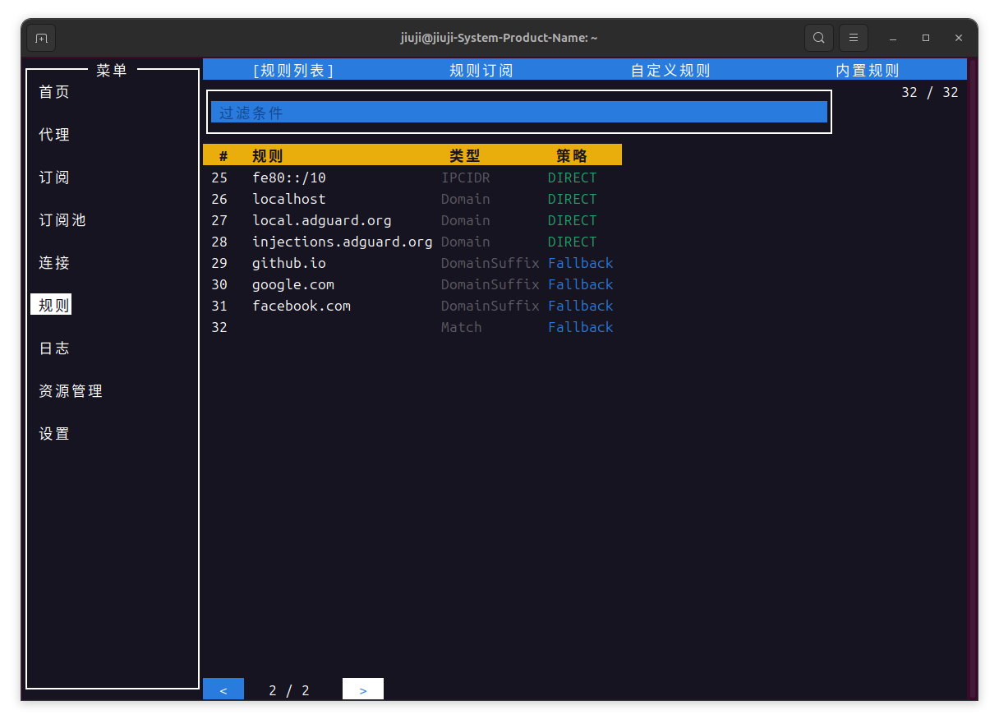
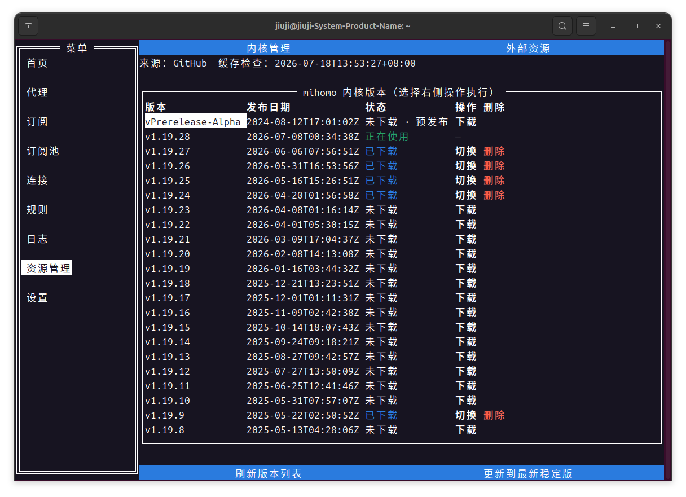

# mihomo-tui

mihomo-tui is a terminal UI and daemon management tool for [mihomo](https://github.com/MetaCubeX/mihomo) (Clash Meta). Built with [rivo/tview](https://github.com/rivo/tview), it targets headless Linux servers: the TUI communicates with an IPC daemon to manage the mihomo process, subscriptions, rules, kernel versions, and networking safely.

[中文文档](README.zh.md)

## Features

- **Proxy Management** — Visual node list with latency sorting, multi-select speed testing, and automatic best-node selection
- **Subscription Pools & Active Takeover** — Import from URL, local file, pasted content, or stdin; the daemon validates and caches subscriptions, preserves the last working version, and supports offline bootstrap
- **Highly Available Subscription Pools** — Ordered failover and merge modes with active-source, cache, health, failure-count, and switch-reason visibility
- **Subscription Usage Metadata** — Parses common `subscription-userinfo` and CDN-prefixed headers, expiry data, and runtime provider metadata
- **Rule Management** — View active rules; enable, disable, edit, reorder, and restore built-in rules; place custom rules before or after built-ins
- **Kernel & Resource Management** — Cached Release list with multi-version download, switch, delete, and progress display; configurable GeoIP / GeoSite download URLs
- **Connection Monitoring** — Real-time active connections, traffic statistics, and connection details
- **Latency Testing** — Batch node latency tests with visual result sorting
- **System Proxy** — One-click toggle for system proxy (HTTP/SOCKS5)
- **TUN Mode** — Support for TUN mode and routing configuration
- **Log Viewer** — Real-time scrolling logs with filtering and pause support
- **systemd Service** — Built-in service install/uninstall with auto-start support
- **Mouse Support** — Clickable buttons, page switching, and node selection via mouse
- **Dynamic Paging** — Automatically adapts form and proxy list pagination when terminal size changes
- **TUN Docker Compatibility** — Fixes Docker container packet routing under TUN mode so host ports remain accessible from containers

## Screenshots

| Proxy Page | Rules Page | Resource Management |
|:----------:|:----------:|:-------------------:|
|  |  |  |

## System Requirements

- **Operating System**: Linux (amd64 / arm64 / armv7 / 386)
- **Runtime Mode**: Root privileges required for service installation; TUI client can run as a regular user

## Quick Install

Use the official one-click install script (recommended):

```bash
sudo bash -c "$(curl -fsSL https://raw.githubusercontent.com/WangZhongDian/mihomo-tui/main/scripts/install.sh)"
```

Install a specific version:

```bash
sudo bash -c "$(curl -fsSL https://raw.githubusercontent.com/WangZhongDian/mihomo-tui/main/scripts/install.sh)" -s -- -v v0.1.0
```

After installation, the systemd service will be registered and started automatically.

## Manual Installation

1. Go to the [Releases](https://github.com/WangZhongDian/mihomo-tui/releases) page and download the binary for your architecture
2. Place the executable in your system PATH (e.g., `/usr/local/bin`)
3. Install the systemd service:

```bash
sudo mihomo-tui install_service
```

## Usage

### Start the TUI Client

```bash
mihomo-tui
```

### Command Line Options

```text
mihomo-tui — mihomo terminal UI and daemon manager

Usage:
  mihomo-tui [options]                           Start the TUI client
  mihomo-tui server [-d <directory>]             Start the background IPC service
  mihomo-tui subscription import <import option> Import a subscription for daemon takeover
  mihomo-tui install_service                     Install the systemd service (root required)
  mihomo-tui uninstall                           Uninstall the systemd service (root required)
  mihomo-tui grant_operator <user>               Grant a regular user IPC management access (root required)
  mihomo-tui cleanup                             Clean system-proxy and TUN environment (root required)
  mihomo-tui tun_diagnose                        Print a TUN routing dry-run plan; makes no changes
  mihomo-tui tun_debug [--apply]                 Print TUN preflight; rebuild rules only with --apply (root required)
  mihomo-tui version                             Show version information
  mihomo-tui help                                Show help

Global options (place before a subcommand):
  -d <directory>       Specify the configuration directory
  -standalone          Start an embedded IPC daemon (TUI only)

subscription import options (exactly one source is required):
  --url <URL>          Import a remote subscription URL
  --file <path>        Read and import a local subscription file
  --stdin              Read subscription content from standard input
  --name <name>        Optional subscription display name
  --via-local-proxy    Refresh a remote URL through the local mihomo HTTP proxy
```

Examples:

```bash
mihomo-tui --standalone
mihomo-tui subscription import --url 'https://example.com/sub?token=***' --name my-subscription
mihomo-tui subscription import --file ./subscription.yaml
cat subscription.txt | mihomo-tui subscription import --stdin --name offline-subscription
sudo mihomo-tui grant_operator <user>
mihomo-tui tun_debug
sudo mihomo-tui tun_debug --apply | tee tun-debug.log
```

`tun_diagnose` and `tun_debug` without arguments are read-only diagnostics: they report the egress interface, project state, active-TUN conflicts, IPv6 risk, and the planned commands without changing networking. Only `sudo mihomo-tui tun_debug --apply` removes and rebuilds **project-owned** TUN policy routes and nftables/iptables-legacy rules.

When TUN is enabled, mihomo-tui installs IPv4 return-path protection before starting the core. It refuses concurrent activation when Clash Verge, another mihomo instance, or sing-box already owns an active TUN default route, protecting Docker, SSH, and VPN return traffic. The repair currently covers IPv4 only and warns when an IPv6 default route exists.


### Common Commands

```bash
# Check service status
sudo systemctl status mihomo-tui

# Stop / Restart service
sudo systemctl stop mihomo-tui
sudo systemctl restart mihomo-tui

# Uninstall service
sudo mihomo-tui uninstall
```

## Interface Navigation

Once the TUI is running, use the following keyboard shortcuts:

| Shortcut | Description |
|----------|-------------|
| `Tab` | Switch focus |
| `↑/↓` | Move up/down |
| `Enter` | Confirm selection |
| `Esc` / `q` | Go back / exit |
| `PgUp` / `PgDn` | Page through forms / lists |
| `Space` | Check / uncheck checkbox |

## Project Structure

```
mihomo-tui/
├── cmd/              # Command line entry points
├── mihomotui/        # Core logic
│   ├── ui/           # TUI interface (tview)
│   ├── config.go     # Configuration management
│   ├── daemon*.go    # IPC service and handlers
│   └── ...
├── scripts/          # Install scripts
├── .github/workflows/# CI/CD
├── main.go           # Main entry point
└── go.mod
```

## Build

Requires Go 1.26+:

```bash
go build -ldflags="-s -w" -o mihomo-tui .
```

Cross-compilation example (ARM64):

```bash
CGO_ENABLED=0 GOOS=linux GOARCH=arm64 go build -ldflags="-s -w" -o mihomo-tui-linux-arm64 .
```

## Release Workflow

This project uses GitHub Actions for automated builds and releases:

1. Update the version number locally (`mihomotui/version.go`)
2. Commit and push the code
3. Tag to trigger the build: `git tag v0.x.x && git push origin v0.x.x`
4. GitHub Actions will automatically build multi-architecture binaries and publish them to the Release page

## Supported Architectures

| Architecture | Description |
|--------------|-------------|
| `amd64` | x86_64, mainstream servers / PCs |
| `arm64` | aarch64, ARM servers / Raspberry Pi 4 |
| `armv7` | ARMv7, Raspberry Pi 3/4 (32-bit) |
| `386` | i386, legacy device compatibility |

## License

[MIT](LICENSE)
